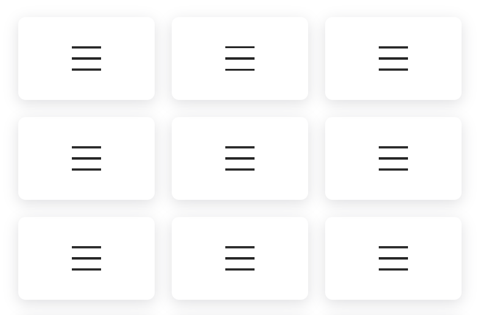

# Hamburger Menu Icons

Hamburger Menu Icons is a set of 12 unique, animated icons built using pure HTML and CSS. Each icon features smooth, interactive animations that activate on hover or click, adding a dynamic, modern touch to your website's navigation. Lightweight and fully responsive, these icons integrate seamlessly into any project, enhancing user experience without requiring JavaScript. Designed for flexibility, they adapt effortlessly to various design styles and screen sizes.

## Table of Contents

1. [Live Demo](#live-demo)
2. [Preview](#preview)
3. [Features](#features)
4. [Installation & Usage](#installation--usage)
5. [Code Overview](#code-overview)
6. [Technologies Used](#technologies-used)
7. [Author](#author)

## Preview

## Live Demo

View the hamburger menu icons in action on the [Live Demo](https://your-live-demo-link.com).

## Features

- **12 Distinct Icons:** Each icon has a unique animation and transition effect.
- **Interactive Animations:** Icons animate on hover or when clicked.
- **CSS-only Implementation:** No JavaScript is required for the animations.
- **Responsive Design:** Icons are styled to fit well in various screen sizes.

## Installation & Usage

- [Download ZIP](https://github.com/programmer-rahad/hamburger-menu-icons/archive/refs/heads/main.zip)
- Navigate to the project folder and open the `index.html` file in your preferred web browser.
- Hover over or click on the hamburger menu icons to see the animations in action.

## Code Overview

- **HTML:** Contains a `section` element with a `container` div holding each hamburger menu icon.
- **CSS:** Styles and animations for the hamburger menu icons are defined within the `<style>` tag in the HTML file.

## Technologies Used

- HTML5
- CSS3
- Responsive Web Design
- CSS Animations

## Author

Created and maintained by [Rahad](https://www.github.com/rahadpro).  
For inquiries or feedback, feel free to reach out.

**Note:** This project is part of my portfolio and is not intended for use or modification by others.  
All rights are reserved.

If you have any questions or feedback, feel free to contact me via [my website](https://www.rahad.me) or [LinkedIn](https://www.linkedin.com/in/rahadpro) or [email](mailto:rahad.pro.dev@gmail.com).
