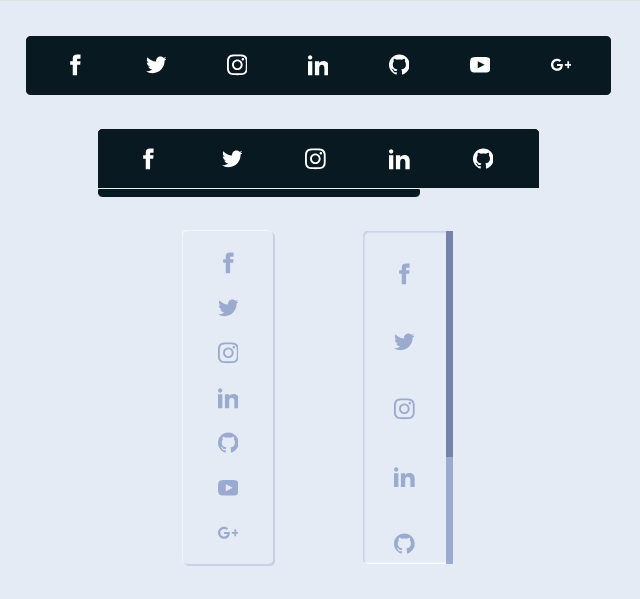

# Icons Bar

**Icons Bar** is a collection of beautifully designed icon bars that feature both horizontal and vertical scrolling options. Built with pure HTML and SCSS, this project showcases responsive and interactive icon bars, perfect for modern web applications. Lightweight, customizable, and easy to integrate into various design styles.

## Table of Contents

1. [Live Demo](#live-demo)
2. [Preview](#preview)
3. [Features](#features)
4. [Installation & Usage](#installation--usage)
5. [Code Overview](#code-overview)
6. [Technologies Used](#technologies-used)
7. [Author](#author)

## Preview

## Live Demo

View the interactive icons bar in action on the [Live Demo](https://icons-bar.netlify.app).

## Features

- **Multiple Layouts:**
  - Horizontal Icon Bar
  - Vertical Icon Bar
  - Scrollable Horizontal Icon Bar
  - Scrollable Vertical Icon Bar
- **Interactive Animations:** Smooth hover effects for an engaging user experience.
- **Custom Scrollbar:** Stylish scrollbars for horizontal and vertical icon bars.
- **Responsive Design:** Optimized for different screen sizes and devices.
- **Pure CSS Implementation:** No JavaScript required.

## Installation & Usage

1. [Download ZIP](https://github.com/programmer-rahad/icons-bar/archive/refs/heads/main.zip).
2. Extract the ZIP file to your project directory.
3. Open the `index.html` file in your browser to view the icon bars.

## Code Overview

- **HTML:** Contains the structure of the icon bars with links and SVG icons.
- **SCSS/CSS:** Styles and animations are defined to create a modern and responsive layout.
  - Horizontal and vertical layouts.
  - Custom hover effects and scrollbars.

## Technologies Used

- HTML5
- SCSS (CSS Preprocessor)
- CSS 3
- Responsive Web Design

## Author

Created and maintained by [Rahad](https://www.rahad.me).  
For inquiries or feedback, feel free to reach out.

**Note:** This project is part of my portfolio and is intended solely for demonstration purposes. Unauthorized use, modification, or redistribution is strictly prohibited. All rights are reserved.

If you have any questions or feedback, feel free to contact me via [my website](https://www.rahad.me) or [LinkedIn](https://www.linkedin.com/in/rahadpro) or [email](mailto:rahad.pro.dev@gmail.com).
