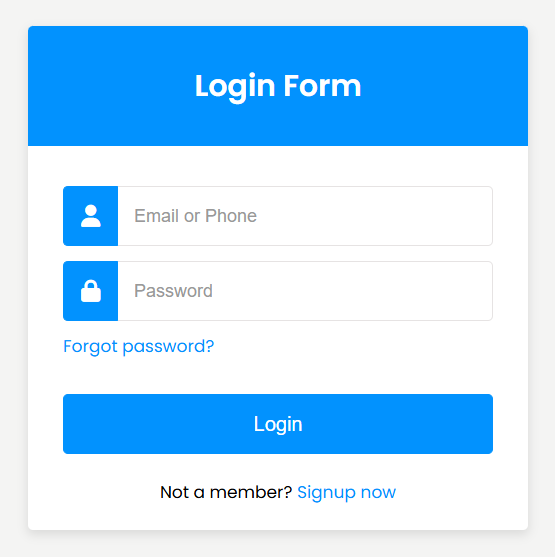

# Login Form

This "Login Form" project is a simple and modern design created using HTML, CSS, and SCSS. It features a fully responsive login form with smooth hover effects and easy-to-use input fields. The design is crafted with user experience in mind, ensuring it's suitable for both personal and professional websites.

## Table of Contents

1. [Preview](#preview)
2. [Live Demo](#live-demo)
3. [Features](#features)
4. [Installation & Usage](#installation--usage)
5. [Code Overview](#code-overview)
6. [Technologies Used](#technologies-used)
7. [Author](#author)

## Preview

## Live Demo

View the live demo of the login form on [Live Demo](https://login-form-component.netlify.app/).

## Features

- **Responsive Design:** The login form adapts beautifully across various screen sizes.
- **Smooth Hover Effects:** Interactive hover effects for buttons and input fields.
- **SCSS Structure:** Well-organized SCSS with variables for colors and reusable mixins.
- **Clean UI:** Simple and modern design for easy user interaction.

## Installation & Usage

- [Download ZIP](https://github.com/programmer-rahad/login-form/archive/refs/heads/main.zip)
- Navigate to the project folder and open the `index.html` file in your preferred web browser.
- Enjoy the smooth animations and clean login form.

## Code Overview

- **HTML:** Contains the structure of the login form, including input fields, buttons, and links.
- **SCSS:** Well-structured SCSS code, including variables for primary and secondary colors, mixins for reusable styles, and smooth animations.

## Technologies Used

- HTML5
- SCSS (CSS Preprocessor)
- CSS3
- Responsive Web Design

## Author

Created and maintained by [Rahad](https://www.rahad.me).  
For inquiries or feedback, feel free to reach out.

**Note:** This project is part of my portfolio and is not intended for use or modification by others.  
All rights are reserved.

If you have any questions or feedback, feel free to contact me via [my website](https://www.rahad.me) or [LinkedIn](https://www.linkedin.com/in/rahadpro) or [email](mailto:rahad.pro.dev@gmail.com).
