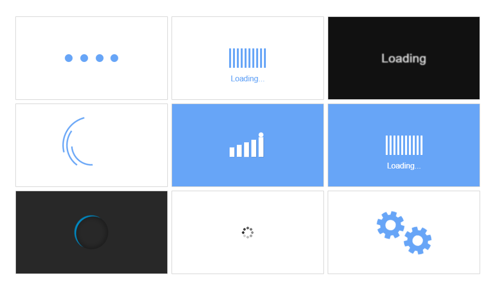

# Preloaders

**Preloaders** is a collection of 33 beautifully designed loading animations crafted with pure HTML, SCSS, and SVG. Lightweight, responsive, and customizable, these preloaders seamlessly integrate into any web project, offering a variety of creative options to enhance the user experience during loading times.

## Table of Contents

1. [Preview](#preview)
2. [Live Demo](#live-demo)
3. [Features](#features)
4. [Installation & Usage](#installation--usage)
5. [Code Overview](#code-overview)
6. [Technologies Used](#technologies-used)
7. [Author](#author)

## Preview

## Live Demo

View the Preloaders in action on the [Live Demo](https://preloaderss.netlify.app/).

## Features

- **Diverse Preloader Designs:** Includes 33 unique and visually appealing preloader animations, designed to suit various needs and styles.
- **Modern Aesthetics:** Features a clean, contemporary design crafted with SCSS.
- **Lightweight CSS Animations:** Built using only SCSS, offering lightweight and smooth animations.
- **Scalable SVG Animations:** Some preloaders are created with SVG, with animations embedded directly within the SVG structure.
- **Optimized Performance:** Responsive, lightweight, and optimized for fast loading in modern web environments.
- **Fully Customizable:** Easily adjust colors, sizes, and animation speeds to fit your design.

## Installation & Usage

- [Download ZIP](https://github.com/programmer-rahad/preloaders/archive/refs/heads/main.zip)
- Extract the downloaded ZIP file.
- Navigate to the project folder and open the `index.html` file in your preferred web browser to view the preloaders.

## Code Overview

- **HTML:** Preloaders are structured with semantic HTML tags, making integration straightforward.
- **SCSS/CSS:** Each preloader's animation is crafted for smooth transitions and performance optimization.
- **SVG Animations:** Some preloaders utilize inline SVGs with animate elements for lightweight and scalable vector animations.

## Technologies Used

- HTML5
- SCSS (CSS Preprocessor)
- CSS3

## Author

Created and maintained by [Rahad](https://www.rahad.me).  
For inquiries or feedback, feel free to reach out.

**Note:** This project is part of my portfolio and is intended solely for demonstration purposes. Unauthorized use, modification, or redistribution is strictly prohibited. All rights are reserved.

If you have any questions or feedback, feel free to contact me via [my website](https://www.rahad.me) or [LinkedIn](https://www.linkedin.com/in/rahadpro) or [email](mailto:rahad.pro.dev@gmail.com).
